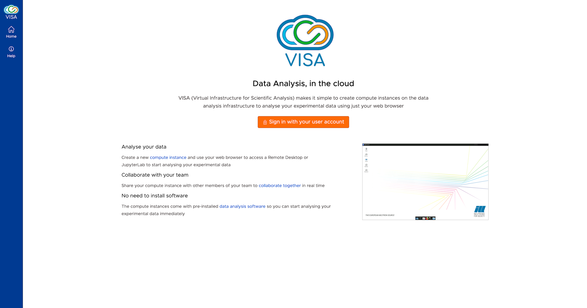
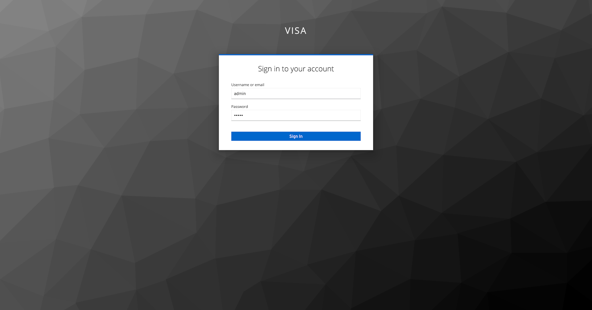
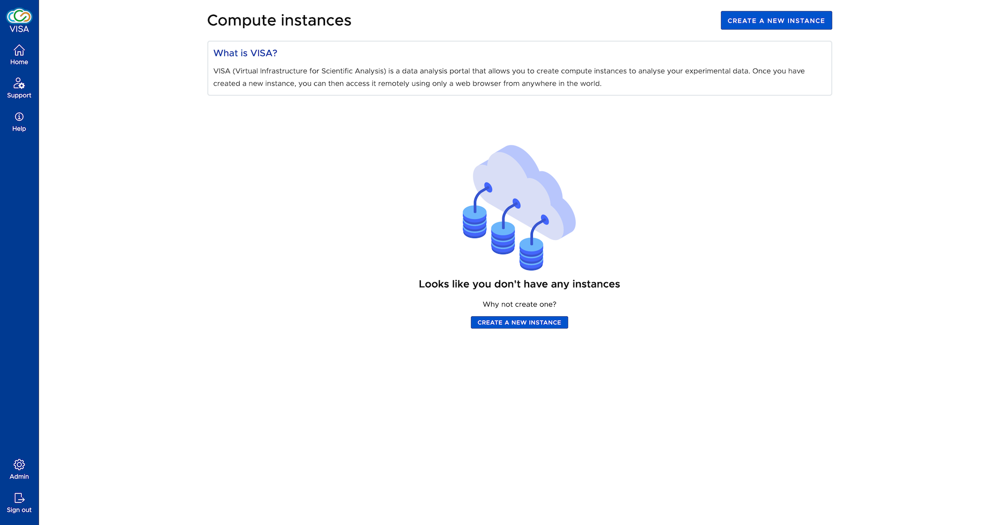
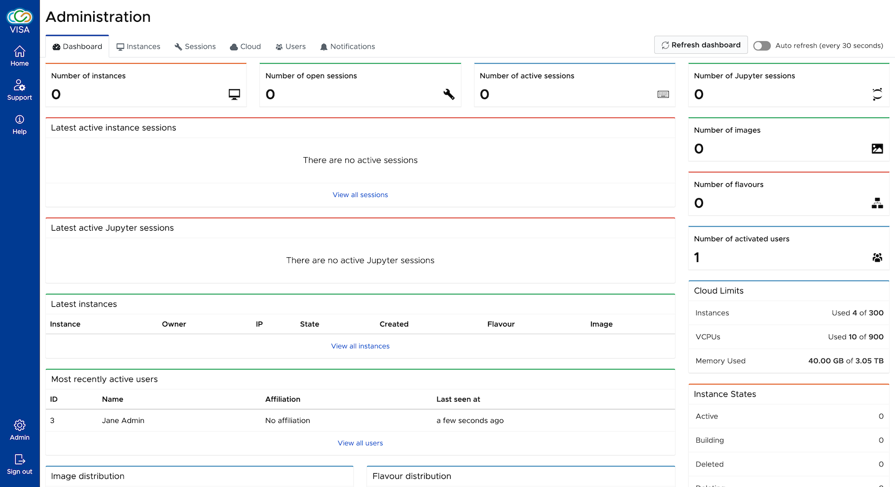
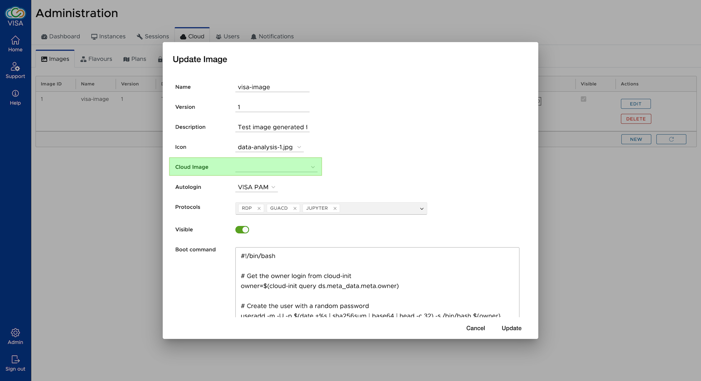
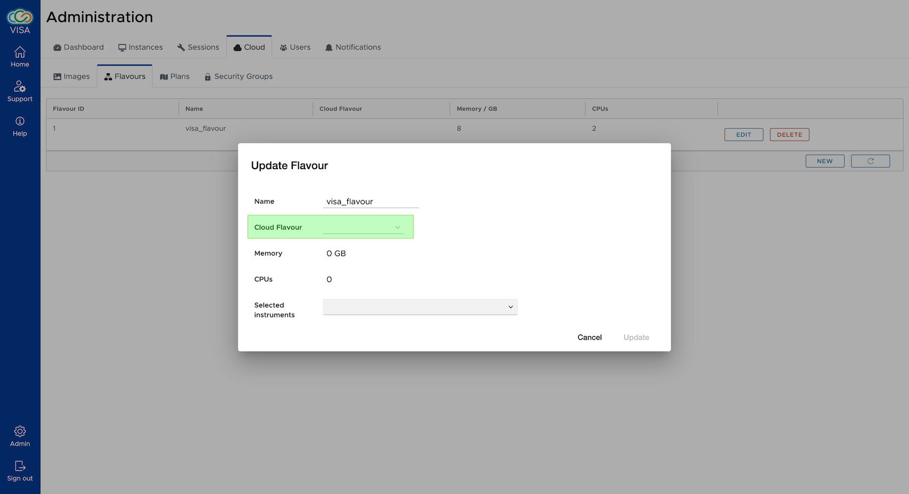
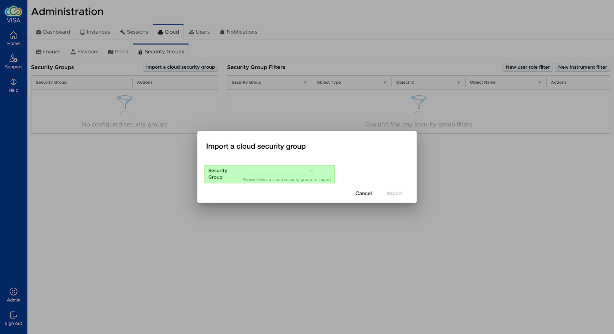

# VISA Demo

## Introduction

VISA Demo is an easy way to test the [VISA Platform](https://visa.readthedocs.io/en/latest/index.html). 

It provides the following services out of the box:

 - VISA Application Platform
 - NGINX reverse proxy
 - OpenID Connect Authentication (KeyCloak)
 - A preconfigured PostgreSQL Database
 - MailDev development email server
 - Docker-Compose deployment 

All these services run in a self-contained virtual machine. 

It is intended to be used with an existing OpenStack installation and requires a minimum of configuration and integration.

> Please note this demo project is not suitable for production but can be used as a guide to achieve this.

It also contains a pre-configured VM for building the example VISA Demo virtual machine image.

## Prerequisites

### Host software

To run the demo we recommend using a host machine with at least 8GB RAM. You will also need to install Vagrant and VirtualBox. 

- [Install Vagrant](https://www.vagrantup.com/downloads)
- [Install VirtualBox](https://www.virtualbox.org/)

> Please make sure you install the latest version of VirtualBox (currently 6.1)

Vagrant is used to build and configure a virtual machine in VirtualBox. This demo builds an Ubuntu 20.04 environment, installs Docker and launches VISA and the necessary services (as described above). The networking of the virtual machine is also pre-configured to provide simple access to the services from the host machine.

### Cloud platform (OpenStack)

The demo is designed to run on an existing OpenStack platform (the configuration of VISA to use the OpenStack API is explained below) and requires knowledge of some basic OpenStack concepts. Some administration of the OpenStack platform is also necessary and as such, it is assumed that the installation of the VISA demo is performed in collaboration with an administrator of the OpenStack instance.

Specifically, you will be required to do the following in OpenStack:
 - Upload a virtual machine *Image*
 - *Flavour* creation (Optional if an existing flavour can be used)
 - Creation of *Application Credentials*
 - *Security Group* management

These concepts are explained in more detail below however we assume a basic working knowledge of them. 

### Example VISA virtual machine image

You will need to build the [example VISA Virtual Machine Image](https://github.com/ILLGrenoble/visa-image-template-example) and upload it into OpenStack. This image has been provided as a template to production images that VISA uses to creates instances. 

[Documentation](docs/visa-image.md) is provided on building it from a machine with the required dependencies, or using Vagrant and a pre-configured virtual machine. The first of these options is the recommended way as it requires a virtualisation process: doing this within a virtual machine is extremely slow. Having built the image, the documentation describes how it should be uploaded to OpenStack.

### Proxy settings

If you need to use an HTTP proxy, the local (host computer) environment variables `http_proxy`, `https_proxy` and `no_proxy` must be set. 

These environment variables will be necessaery for Vagrant and are automatically transfered to the VMs. 

## Configuring and running the VISA services

1. **Clone the [VISA Demo](https://github.com/ILLGrenoble/visa-demo) project.**

    Open a terminal and change directory to the cloned project. This will be the main working directory for all of the steps below.

2. **Install Vagrant plugins.**

   Some Vagrant plugins are needed to launch the demo. In order to install them, run

    ```bash
    vagrant plugin install vagrant-proxyconf vagrant-reload vagrant-vbguest
    ```

3. **Configure the environment variables.**

    The `demo.env` file has been pre-configured with all the environment variables necessary to run VISA and the associated services. 
  
    However, all OpenStack related variables (ones starting with `VISA_CLOUD_*`) need to be specified. You will find these at the top of the `demo.env` file. 
    
    You will need to configure VISA with:

    - OpenStack API endpoints
    - Application Credential (authentication for VISA to use the endpoints. You will need to create one within OpenStack if you haven't already done so)
    - Network identifiers

    Please refer to the [VISA Documentation](https://visa.readthedocs.io/en/latest/deploying/deploying-env-vars.html#openstack-cloud-provider) for more details.

    > [Documentation](https://visa.readthedocs.io/en/latest/openstack/openstack-troubleshooting-api.html) is available to test your OpenStack configuration by directly sending HTTP requests to the OpenStack API.

4. **Start the VISA Demo virtual machine.**

    You can start the virtual machine and bring up VISA and all the associated services with the following command:

    ```bash
    vagrant up
    ```

    > Please note that this will take several minutes to create a virtual machine with the Ubuntu image and VISA services.

    When it is completed you should be able to access the VISA web application at [http://10.50.0.120/](http://10.50.0.120/) (see below for more details).

    <div>
        
    </div>

5. **Log in to VISA as Admin.**

    Once the virtual machine with VISA is running you can log in to the [VISA web application](http://10.50.0.120) using the credentials for `admin` (username and password are the same). 

    <div>
        
    </div>
    
    Once you've logged in you will be presented with the VISA homepage.

    <div>
        
    </div>

    Selecting the Admin menu item you can then follow the steps below to finish the configuration of VISA.

    <div>
        
    </div>

6. **Configure VISA to use the example VISA virtual machine image.**

    An [OpenStack image](https://docs.openstack.org/horizon/latest/admin/manage-images.html) is a template (based on a Linux distribution or Windows) used to spawn virtual machine instances.

    The database of the VISA Demo has been pre-configured to use the example VISA virtual machine image (based on an Ubuntu distribution) however it requires the image identifier in OpenStack to be configured in the database.

    This can be done simply by using the [VISA Image Admin interface](http://10.50.0.120/admin/cloud/images). Click on the `update` button of `visa-image` and then configure the Cloud Image to use the example VISA image that you have uploaded to OpenStack.

    <div>
        
    </div>

7. **Configure VISA to use an OpenStack flavour.**

    An [OpenStack flavour](https://docs.openstack.org/horizon/latest/admin/manage-flavors.html) specifies the resources to use for an instance (ie the number of vCPUs and RAM).

    VISA needs to be configured to use a flavour that has been configured in OpenStack. A flavour is used by OpenStack to allocate resources to an instance.

    As with the image, this can be done using the [VISA Flavour Admin interface](http://10.50.0.120/admin/cloud/flavours). Click on the `update` button of `visa-flavour`and configure the Cloud Flavour to use one that exists in OpenStack. For this demo you do not need many resources (even 1 vCPU and 4GB RAM would be enough).

    <div>
        
    </div>
  
8. **Configure the instance Security Groups.**

    [Security Groups](https://docs.openstack.org/horizon/latest/user/configure-access-and-security-for-instances.html) in OpenStack are used to configure the firewall for an instance. 
    
    For this demo, VISA needs to be able to access the remote desktop and Jupyter services running in the instance. Specifically a security group must be configured to have ports 3389, 4822 and 8888 accessible on Ingress from your host machine.

    Once this security group has been created in OpenStack, you can configure it in VISA using the [Security Group Admin interface](http://10.50.0.120/admin/cloud/security_groups). Click on the *Import a cloud security group* button and you will be presented with a list of all available OpenStack security groups.

    <div>
        
    </div>

    Having done this, the imported security groups will be associated with all instances when they are created.


## Accessing the services

Having followed the steps above you should now have a fully functional VISA Demo. We now describe the services provided and how to access them.

> All the services are available on IP address `10.50.0.120`. For simplicity we are running the services on standard HTTP without SSL certificates: for obvious reasons this should not be done in a real environment.

### VISA Web Application

The VISA web application can be accessed on the standard HTTP port, just go to [http://10.50.0.120/](http://10.50.0.120/).

Several accounts are available in VISA, with different access rights (for simplicity the passwords are the same as the usernames): 

|username/password | Role | Description|
|---|---|---|
|user/user| | No roles are associated to this user so it is considered to be a standard user, with no additional features available.|
|scientist/scientist| INSTRUMENT_SCIENTIST | An instrument scientist can provide support to other users who have instances associated to their instrument. A support menu is available to them. |
|it_support/it_support | IT_SUPPORT| Like the scientist, an IT Support user can provide support too, but will be able to help all VISA users. |
|admin/admin | ADMIN| An Admin user has access to the Admin menu and can configure the VISA setup and examine the usage. |

The [VISA Documentation](https://visa.readthedocs.io/en/latest/index.html) gives a more complete picture on how to fully [deploy VISA in production](https://visa.readthedocs.io/en/latest/deploying/deploying-contents.html).

The documentation also illustrates how to [administer VISA](https://visa.readthedocs.io/en/latest/admin/admin-contents.html) with the Admin UIs.

#### User support scenarios

The database has been configured so that the standard user (login as `user`) can create an instance associated to an experiment on an instrument called `Instrument 1`. 

The scientist user (login as `scientist`) has been configured to be responsible for this instrument and so when they connect they will see the instances of `user` in the [Support page](http://10.50.0.120/support/instances) and can connect to them too.

Similarly, the IT Support user (login as `it_support`) will be able to see all the instances of all other users. 

The Admin user (ie `admin`) sees the same support pages as the IT Support user.

### SSH

To open an SSH connection to the VISA virtual machine, type 

```bash
vagrant ssh
```

Once you are connected, you can go to the deployment directory: 

```bash
cd /vagrant/
```

> Please note we are using `docker-compose` to run all the services, so you can use all the standard `docker` commands.

If you wish to view the application logs then run the following command:

```bash
docker-compose logs
```

To see that state of all the containers managed by `docker-compose`then run:

```bash
docker-compose ps
```

#### Restarting the VISA demo application

To restart the VISA demo a systemd service is available. 

To stop, start and restart the application modify the following command accordingly:

```bash
sudo systemctl <stop/start/restart> visa-docker
```

You can also run the standard `docker-compose up/down` commands.

### Keycloak

The Keycloak admin interface is available at [http://10.50.0.120:9990/auth/admin/master/console/](http://10.50.0.120:9990/auth/admin/master/console/). 

The Keycloak admin username and password are both `keycloak`.

### Maildev

The Maildev web interface is available at [http://10.50.0.120:7080](http://10.50.0.120:7080). 

The VISA demo has been configured to send all emails to this servive so you can see the example emails that are sent.

### PostgreSQL

The PostgreSQL server is available on port `5432`. 

To connect to the database you can use your postgres client, or use the command line by connecting to the virtual machine as follows:

  ```bash
  vagrant ssh
  docker-compose -f /vagrant/docker-compose.yml exec visa-db psql -U visa
  ```

## Cleanup

To uninstall VISA from your computer, run 

```bash
vagrant destroy
```

## Acknowledgements

<div>
     
</div>

VISA has been developed as part of the Photon and Neutron Open Science Cloud (<a href="http://www.panosc.eu" target="_blank">PaNOSC</a>)


PaNOSC has received funding from the European Union's Horizon 2020 research and innovation programme under grant agreement No 823852.
